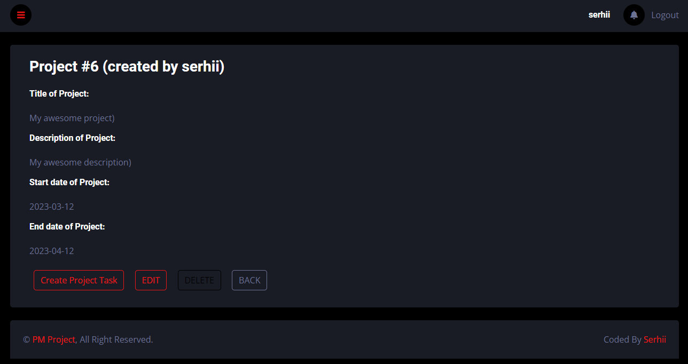
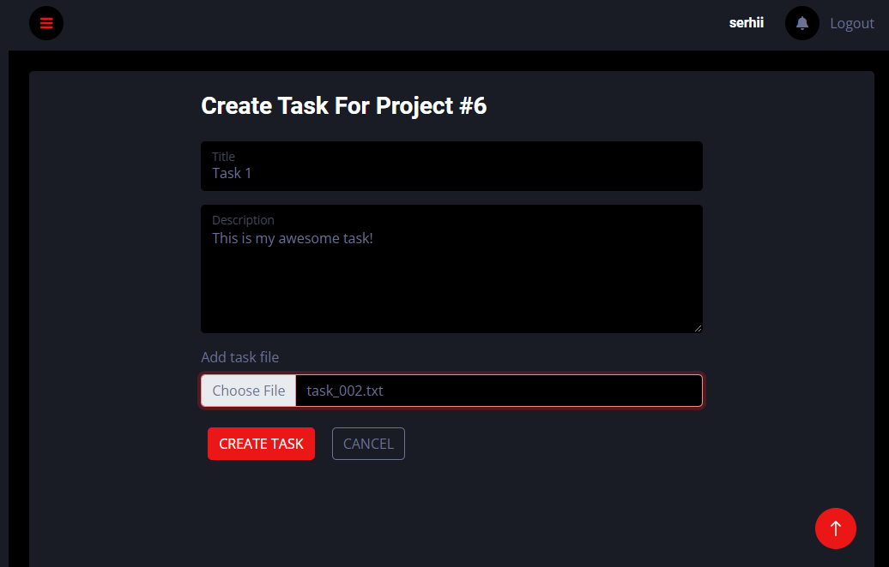
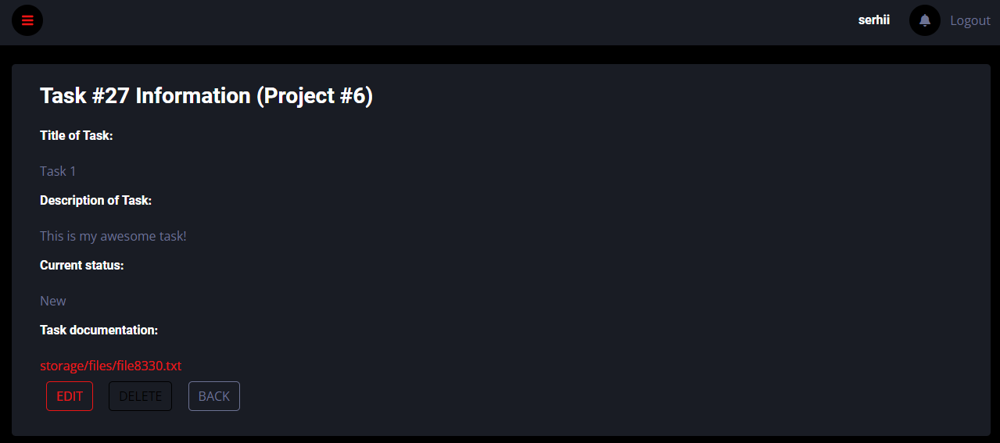
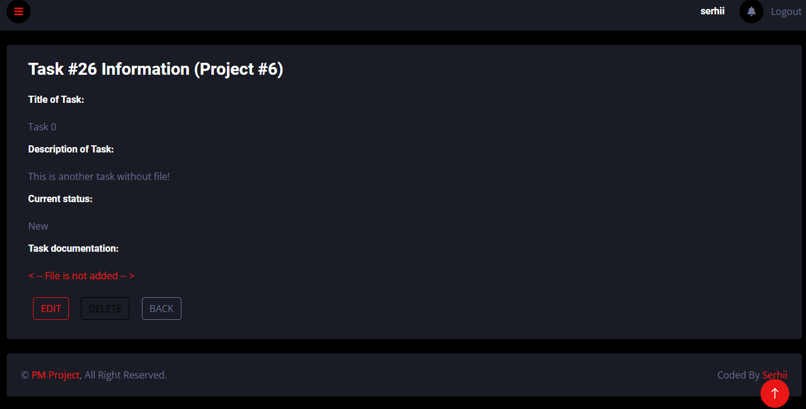
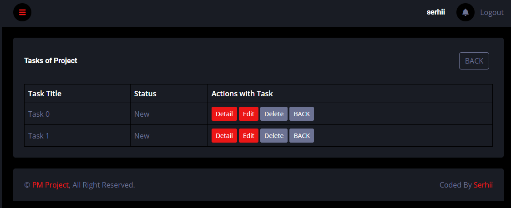

## About this project

This is an example of simple system for keeping track of project tasks:

• Basic registration is present (user registration + login);

• Possible main actions: create a project -> creates tasks in the project;

• Tasks also have states (such as New, In Progress, and Done) that you can change;

• You can also add 1 file (any image or document) when creating a task. This file can be downloaded during creation of the task or later;

• There are factories and seeders to create fake data in the DB for tests;

• CRUD is implemented for both entities Projects and Tasks.

The project is based on
 

